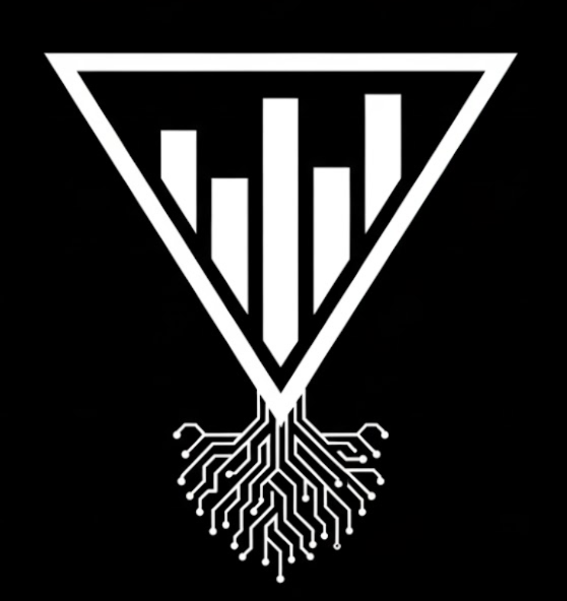

<p align="center">
  <picture>
    <source media="(prefers-color-scheme: dark)" srcset="assets/logo.png">
    <source media="(prefers-color-scheme: light)" srcset="assets/logo-light.png">
    
  </picture>
</p>

<p align="center"><em>Autonomy, Contained.</em></p>

# Chainwatch (prototype)

[](https://github.com/ppiankov/chainwatch/actions/workflows/ci.yml)
[](https://www.python.org/downloads/)
[](LICENSE)
[](https://github.com/psf/black)

Chainwatch is a runtime control plane for AI agents.

AI agents need broad, dynamic access to tools and data to be useful. Existing security controls
(IAM, PAM, NGFW, DLP) validate identity and individual actions, but cannot observe or enforce safety
across the full execution chain of an autonomous agent.

This creates a gap where an agent can:
- access more data than required,
- combine sensitive datasets (mosaic risk),
- and produce unsafe outputs,
without violating any single control.

Chainwatch explores a new control point: **chain-aware runtime enforcement**.

Designed to integrate with multiple agent execution models, including tool-driven, SaaS-hosted, and local agents.
Enforcement is mode-agnostic: it applies regardless of whether an LLM is used, because leakage and over-collection can occur in “no-LLM” report workflows too.

## What it does (goal)
- Intercepts agent tool/data actions
- Correlates actions into execution chains (traces)
- Evaluates policy using evolving chain context
- Enforces decisions mid-execution:
  - allow / deny
  - allow with redaction
  - require approval
  - rewrite outputs

## What it is not
- A prompt firewall or jailbreak detector
- An IAM/RBAC replacement
- A full agent framework
- A production security product (yet)

## Start Here

**New to Chainwatch?** Read in this order:

1. **[Core Philosophy](#core-philosophy)** (below) - Understand the foundational principle
2. **[docs/irreversible-boundaries.md](docs/irreversible-boundaries.md)** - Why boundaries, not blocklists (650+ lines)
3. **[Quick Start](#quick-start)** (below) - Install and run the demo
4. **[docs/INDEX.md](docs/INDEX.md)** - Complete documentation guide

**Want to implement v0.2.0?** Start with:
- **[docs/design/v0.2.0-specification.md](docs/design/v0.2.0-specification.md)** - Implementation blueprint (1000+ lines)

**Want to understand RootOps?** Read:
- **[docs/DESIGN_BASELINE.md](docs/DESIGN_BASELINE.md)** - Principiis obsta principle
- **[docs/security-classes.md](docs/security-classes.md)** - Forbidden architectures (CW-01 through CW-05)
- **[docs/rootops-antipatterns.md](docs/rootops-antipatterns.md)** - "Convenient Trust Amplifier" antipattern

**Questions?** See [docs/FAQ.md](docs/FAQ.md)

**What is Chainwatch NOT?** See [docs/OUT_OF_SCOPE.md](docs/OUT_OF_SCOPE.md)

## Core Philosophy

**Principiis obsta** — resist the beginnings.

Chainwatch intervenes early, at the point where small, acceptable actions begin to form irreversible outcomes. It operates at the root of events, not their aftermath.

👉 **Read:** [`docs/DESIGN_BASELINE.md`](docs/DESIGN_BASELINE.md) - Shared design principle

### Three Foundational Ideas

### 1. Irreversible Boundaries (Two Limbs)
Some transitions in execution context cannot be undone. Chainwatch treats these as **hard boundaries** where the system refuses continuation regardless of model intent.

**Limb A: Execution Boundaries**
- Payment commitment (money leaves account)
- Credential exposure (secrets cannot be "unread")
- Data destruction (files cannot be recovered)
- External communication (messages cannot be unsent)

**Limb B: Authority Boundaries**
- Proxied commands (instruction origin crosses trust boundary)
- Injected control (malicious steering enters execution chain)
- Cross-context commands (isolation violation)
- Replayed sessions (temporal integrity compromised)

**Real incident:** The Clawdbot attack (2026) was an authority boundary violation — attacker's proxied commands were accepted as legitimate, leading to full system compromise.

These are not moral judgments. These are **architectural properties**.

**The system NEVER asks the model whether an irreversible action OR instruction is safe.**

👉 **Read:** [`docs/irreversible-boundaries.md`](docs/irreversible-boundaries.md) - Core concept (650+ lines)

### 2. Monotonic Irreversibility
Chainwatch evolves along a single axis:

**Local → Historical → Structural irreversibility awareness**

Correctness ladder: `SAFE → SENSITIVE → COMMITMENT → IRREVERSIBLE` (one-way only)

**North Star:** Chainwatch should never become smarter — only more conservative as execution progresses.

This is not ML. This is not prediction. This is **structural safety**.

👉 **Read:** [`docs/monotonic-irreversibility.md`](docs/monotonic-irreversibility.md) - Canonical evolution path (350+ lines)

👉 **Implement:** [`docs/design/v0.2.0-specification.md`](docs/design/v0.2.0-specification.md) - v0.2.0 implementation blueprint (500+ lines)

### 3. Control Plane, Not Observability

**Observability says:** "I saw the agent buy a course. Here's the log."

**Chainwatch says:** "The agent tried to cross the payment boundary. I stopped it."

Chainwatch refuses execution when chains cross irreversible boundaries.

This is **enforcement**, not **detection**.

👉 **Read:** [`docs/boundary-configuration.md`](docs/boundary-configuration.md) - Configuration guide

---

**Additional context:**
- [`docs/core-idea.md`](docs/core-idea.md) - Original concept: execution chains as first-class entities
- [`docs/position/execution-chain-as-entity.md`](docs/position/execution-chain-as-entity.md) - Why existing tools fail
- [`docs/FAQ.md`](docs/FAQ.md) - Common questions (including: why no ML?)

## Status
Experimental prototype. Expect breaking changes and blunt edges.

## Development rules

- Chainwatch prioritizes runtime control over detection or observability.
- Connectors may be sloppy; the core must be deterministic.
- If an action cannot be intercepted and blocked, it is out of scope.
- Policy decisions must be explainable to a human without statistics.

## Integration strategies

Chainwatch can be inserted at different points depending on the agent runtime.
See `docs/integrations/` for an analysis of supported and rejected approaches.

Only one strategy will be implemented at a time.

## Implementation notes

The current reference implementation is written in Python to optimize
for clarity and iteration speed.

A future implementation may use Go for long-running runtime components
(e.g. proxies, sidecars, or system services) once interception boundaries
and enforcement semantics are proven.

## Quick Start

### Installation

```bash
git clone https://github.com/ppiankov/chainwatch.git
cd chainwatch
make install
```

### Run the Demo

**Option 1: Basic Demo (Quick)**
```bash
make run-demo
```

**Option 2: Realistic Agent Demo (Recommended)**
```bash
make setup-test-data      # Create corporate test data
make run-realistic-demo   # Run agent that tries to accomplish a task
```

The realistic demo shows an agent autonomously trying to analyze SOC team efficiency:
- Agent decides which files to read based on its goal
- Allows reading org charts, SIEM data, performance metrics
- May redact PII from HR employee records
- **Blocks access to salary data** when agent tries cost analysis

Expected output (realistic demo):
```
[Agent] Attempting to read org chart...
✓ Allowed: Org chart read successfully

[Agent] Attempting to read SIEM incidents...
✓ Allowed: SIEM data read successfully

[Agent] Attempting to read HR employee list...
⚠ Allowed: HR data (may contain redacted PII)

[Agent] Attempting to read salary data...
✓ Blocked (expected): Access requires approval: soc_salary_access

✓ Demo successful: Salary access was blocked as expected
```

### Use as Library

```python
from chainwatch.wrappers.file_ops import FileGuard
from chainwatch.enforcement import EnforcementError

actor = {"user_id": "analyst1", "agent_id": "my_agent"}

with FileGuard(purpose="SOC_efficiency", actor=actor) as guard:
    try:
        with open("sensitive_file.csv", "r") as f:
            data = f.read()
        # Use data...
    except EnforcementError as e:
        print(f"Access denied: {e}")

    # Get audit trail
    trace = guard.get_trace_summary()
    print(trace)
```

### Irreversible Boundary Protection (v0.1.1)

Prevent agents from crossing irreversible execution boundaries - actions that cannot be undone once executed:

```bash
# Initialize denylist with sane defaults
chainwatch init-denylist

# Declares irreversible boundaries: payment flows, credential exposure, destructive operations
# Automatically enforced by FileGuard and policy evaluation
```

Example - Block purchases:

```python
from chainwatch.denylist import Denylist
from chainwatch.policy import evaluate
from chainwatch.types import Action, TraceState
from chainwatch.enforcement import EnforcementError

denylist = Denylist.load()  # Loads ~/.chainwatch/denylist.yaml

action = Action(
    tool="browser_navigate",
    resource="https://coursera.org/checkout",
    operation="navigate"
)

result = evaluate(
    action=action,
    state=TraceState(trace_id="session-123"),
    purpose="research",
    denylist=denylist
)

# result.decision == "deny"
# result.reason == "Denylisted: URL matches denylist pattern: /checkout"
```

**Irreversible boundaries detected by default:**
- **Payment commitment:** `/checkout`, `/payment`, `/billing`, `stripe.com/checkout`
- **Credential exposure:** `~/.ssh/id_rsa`, `~/.aws/credentials`, `**/.env`
- **Destructive operations:** `rm -rf`, `sudo su`, `curl ... | sh`

These are not "bad actions" — they are **structural points of no return**.

**Learn more:**
- 📖 [Irreversible Boundaries](docs/irreversible-boundaries.md) - Why boundaries, not blocklists
- 🔧 [Boundary Configuration](docs/boundary-configuration.md) - How to customize
- 🚀 [Monotonic Irreversibility](docs/monotonic-irreversibility.md) - Evolution path

Customize: `vim ~/.chainwatch/denylist.yaml`

See [docs/integrations/clawbot-denylist.md](docs/integrations/clawbot-denylist.md) for Clawbot integration.

### Test with External Agent Tools

See [docs/testing-guide.md](docs/testing-guide.md) for instructions on:
- Testing with Aider, OpenHands, or other Python-based agents
- Creating custom test scenarios with realistic corporate data
- What works now vs. what needs HTTP proxy mode (v0.2.0)

## Development

See [CONTRIBUTING.md](CONTRIBUTING.md) for setup and guidelines.

### Run Tests
```bash
make test
make test-coverage  # Generate HTML coverage report
```

### Format and Lint
```bash
make fmt   # Format with black
make lint  # Check with ruff
make all   # Format, lint, and test
```

### Build Package
```bash
make build
```

## Roadmap

**Evolution Axis:** Local → Historical → Structural irreversibility awareness

See `docs/monotonic-irreversibility.md` for complete evolution design.

### v0.1.2 (Current)
- ✓ Irreversible boundary protection (pattern-based)
- ✓ Default boundaries: payment, credentials, destructive ops
- ✓ Conceptual reframe: from "denylist" to "boundary detection"
- ✓ Core concept documentation (`docs/irreversible-boundaries.md`)
- ✓ Evolution path: monotonic irreversibility design (`docs/monotonic-irreversibility.md`)

### v0.1.0-0.1.1 (Released)
- ✓ File operation wrapper (`FileGuard`)
- ✓ Deterministic policy engine (no ML)
- ✓ SOC efficiency demo (blocks salary access)
- ✓ Unit and integration tests (>85% coverage)
- ✓ CI/CD pipeline (Python 3.10-3.12)
- ✓ Path-based file classification

### v0.2.0 (Designed, Ready to Implement)
**Core concept:** Chain-aware irreversibility (has chain entered zone where this becomes irreversible?)

**Design specification:** `docs/design/v0.2.0-specification.md` (500+ lines)

**Features:**
- Monotonic state transitions (SAFE → SENSITIVE → COMMITMENT → IRREVERSIBLE)
- Zone-based boundary detection (commercial intent, credential exposure, external egress, sensitive data)
- Authority boundary detection (proxy relay, context crossing, temporal violations, injection)
- Compound boundaries (credentials + network = exfiltration)
- Approval workflow CLI (out-of-band, single-use tokens, model cannot observe)
- TraceState evolution (backward compatible with v0.1.x)

**Philosophy locked:** All anti-patterns and warnings from philosophical docs baked into specification.

### v0.3.0 (Future: Irreversibility Graphs)
**Core concept:** Structural boundary mapping (not execution graphs)

- Irreversibility graphs (nodes are recoverability states, edges are loss of reversibility)
- Multi-step boundary detection
- Boundary composition

### v1.0.0 (Vision: Formal Boundary Calculus)
- Provable monotonicity properties
- Compositional boundary reasoning
- Go-based proxy/sidecar for production deployments
- Multi-tenant support
- OpenTelemetry export

**North Star:** Chainwatch should never become smarter — only more conservative as execution progresses.

See [CHANGELOG.md](CHANGELOG.md) for detailed version history.

## Known Limitations

These are intentional MVP constraints:

### Architecture
- **In-memory only**: Events not persisted to database
- **Single-threaded**: Trace management not thread-safe
- **No approval UI**: Approval required but blocks by default (no workflow interface)

### File Wrapper
- **Path-based classification**: May miss obfuscated filenames like `data_20250129.csv`
- **Monkey-patching limitations**: Won't catch C extension file I/O or subprocess calls
- **No write monitoring**: Only read operations are intercepted

### Policy
- **Hardcoded rules**: No YAML/JSON configuration yet (v0.2.0)
- **No content inspection**: Classification based on paths, not file contents (v0.2.0)
- **Structural redaction only**: No LLM-based semantic filtering

### Integration
- **File operations only**: No HTTP/network interception yet (v0.2.0)
- **No agent runtime hooks**: Can't integrate directly with Claude Code, Codex, etc. yet

**Roadmap context:** v0.1.0 proves enforcement semantics (blocking works). v0.2.0 proves insertion into real runtimes via HTTP proxy.

See `docs/integrations/file-ops-wrapper.md` and `docs/decisions/002-file-classification.md` for detailed rationale and evolution plans.

## Case studies
- `docs/case-studies/entropia-chainwatch-intraweb.md` – Using Entropia + Chainwatch to scrutinize a sensitive corporate intraweb safely.
